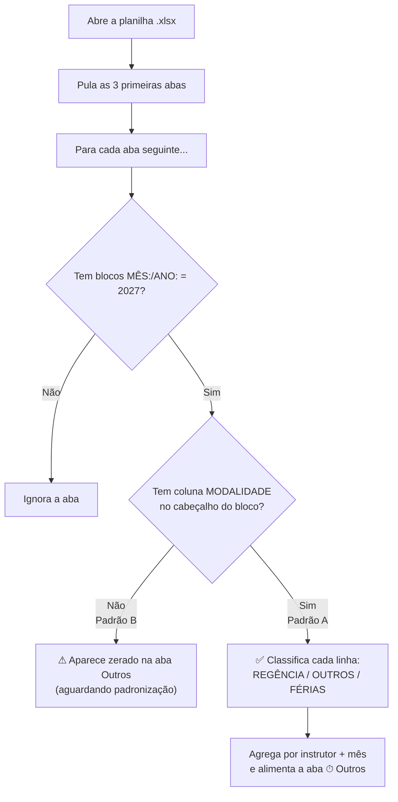

# 📋 Guia de Padronização — Planilha de Regência 2027

> **Objetivo:** Garantir que o BI leia 100% dos instrutores automaticamente, sem trabalho manual de correção.

---

## 🗺️ Estrutura esperada da planilha

```
REGÊNCIA - INSTRUTORES DO QUADRO 2027.xlsx
│
├── DADOS              ← aba de configuração interna (manter)
├── MODELO SEDUC       ← modelo de referência (manter)
├── CONSOLIDADO        ← aba que o BI lê para KPIs e gráficos principais
│   └── (preencher conforme hoje — sem alterações)
│
├── NOME DO INSTRUTOR 1   ← aba individual (PADRÃO A obrigatório)
├── NOME DO INSTRUTOR 2
├── ...
└── NOME DO INSTRUTOR N
```

> [!IMPORTANT]
> A ordem das abas importa. O BI pula as **3 primeiras abas** (DADOS, MODELO SEDUC, CONSOLIDADO) e lê todas as seguintes como abas individuais de instrutores.

---

## ✅ Padrão A — Estrutura obrigatória de cada aba de instrutor

Cada aba individual deve seguir este layout de **cabeçalho de bloco mensal**:

```
Linha N:    [vazio]  [vazio]  [vazio]  [vazio]  MÊS:  [vazio]  01  [vazio]  ANO:  [vazio]  2027
Linha N+1:  EVENTO   MODALIDADE   COMPONENTE / ATIVIDADE   TURNO   1   2   3 ... [dias] ... TOTAL MENSAL   REGÊNCIA
Linha N+2:  [dados das atividades...]
...
Linha K:    TOTAL    [vazio]  ...  [total mensal]  [% regencia]
```

### Colunas obrigatórias no cabeçalho do bloco (linha N+1)

| Coluna | Nome exato | Obrigatório? | Para quê serve |
|--------|-----------|:---:|---|
| A | `EVENTO` | ✅ | Código do evento/turma |
| B | `MODALIDADE` | ✅ **NOVO** | **Classifica o tipo de atividade** |
| C | `COMPONENTE / ATIVIDADE` | ✅ | Nome da disciplina/atividade |
| D | `TURNO` | ⬜ opcional | Matutino / Vespertino / Noturno |
| E..AF | Dias do mês (1, 2, 3...) | ✅ | Horas trabalhadas por dia |
| Penúltima | `TOTAL MENSAL` | ✅ | Soma de horas no mês |
| Última | `REGÊNCIA` | ✅ | % ou horas de regência |

---

## 📊 Tabela de Códigos de Modalidade (coluna MODALIDADE)

Use **exatamente** este formato: `CÓDIGO-DESCRIÇÃO` (número seguido de traço).

| Código | Descrição completa | Categoria no BI |
|:------:|---|:---:|
| `0` | 0-FÉRIAS | Férias |
| `1` | 1-PLANEJAMENTO | ⏱ Outros |
| `2` | 2-REUNIÕES | ⏱ Outros |
| `3` | 3-CAPACITAÇÃO | ⏱ Outros |
| `4` | 4-BANCO DE HORAS | ⏱ Outros |
| `9` | 9-OUTROS | ⏱ Outros |
| `11` | 11-Aprendizagem industrial básico | 📚 Regência |
| `21` | 21-QUALIFICAÇÃO PROFISSIONAL BÁSICA | 📚 Regência |
| `24` | 24-QUALIFICAÇÃO PROFISSIONAL TÉCNICA | 📚 Regência |
| `31` | 31-HABILITAÇÃO TÉCNICA | 📚 Regência |
| `33` | 33-habilitação técnica a distância | 📚 Regência |
| `34` | 34-TÉCNICO DE NÍVEL MÉDIO - ITINERÁRIO V | 📚 Regência |
| `35` | 35-TÉCNICO DE ENSINO MÉDIO - SEDUC | 📚 Regência |
| `51` | 51-Aperfeiçoamento profissional | 📚 Regência |

> [!TIP]
> O BI identifica o código pelo **número no início** da célula. `"2-REUNIÕES"`, `"2 - Reuniões"` e `"2"` funcionam igualmente. O importante é que comece com o número correto.

---

## 🗓️ Checklist de abertura do ano 2027

### Antes de janeiro

- [ ] Duplicar a aba **MODELO SEDUC** e renomeá-la com o nome do novo instrutor
- [ ] Preencher nome, carga horária e área na aba copiada
- [ ] Garantir que o cabeçalho do primeiro bloco mensal (JAN/2027) já tenha a coluna **MODALIDADE**
- [ ] Atualizar a aba **CONSOLIDADO** com todos os instrutores ativos (linha de cabeçalho + dados)
- [ ] Criar um novo link de compartilhamento SharePoint com `&download=1` e atualizar o secret no Streamlit Cloud

### A cada mês (rotina mensal)

- [ ] Preencher as horas diárias em cada aba de instrutor (coluna MODALIDADE preenchida em cada linha)
- [ ] Atualizar o **CONSOLIDADO** com os totais `H/AULA` e `%` do mês encerrado
- [ ] Clicar em **"Atualizar dados agora"** na barra lateral do BI para forçar a recarga

### Ao encerrar o ano 2027

- [ ] Salvar uma cópia final como `REGÊNCIA - INSTRUTORES DO QUADRO 2027 - FINAL.xlsx`
- [ ] Criar nova planilha `REGÊNCIA - INSTRUTORES DO QUADRO 2028.xlsx` baseada no modelo
- [ ] Gerar novo link SharePoint e atualizar o secret no Streamlit Cloud

---

## ⚠️ O que fazer com as abas 2026 sem MODALIDADE (Padrão B)

As abas do Padrão B (sem coluna MODALIDADE) **não aparecem na aba "⏱ Outros (não-aula)"** do BI. Para corrigir os dados de 2026, você tem duas opções:

### Opção rápida — Adicionar MODALIDADE retroativamente
1. Abrir a aba do instrutor
2. Inserir a coluna **MODALIDADE** logo após a coluna **EVENTO** em cada bloco mensal
3. Preencher o código correto para cada linha de atividade

### Opção alternativa — Atualizar somente os meses que importam
Se o objetivo for apenas ter os dados completos do 2º semestre de 2026, priorize preencher a MODALIDADE nos blocos de **AGO a DEZ/2026** das abas que ainda não têm.

---

## 🤖 Como o BI identifica as abas



---

## 📐 Regras importantes

> [!WARNING]
> **Não coloque tabelas auxiliares na Coluna A** das abas individuais ou do CONSOLIDADO. A tabela de códigos `CODIGO / MODALIDADES` que existe no rodapé do CONSOLIDADO (linhas 60+ e 1000+) causa falsos positivos nos filtros do BI. Mova-a para uma aba separada chamada **LEGENDA**.

> [!NOTE]
> O nome do instrutor na aba individual não precisa ser idêntico ao do CONSOLIDADO. O BI cruza os dados pelo nome extraído do topo da aba (linhas 0–10). Quanto mais próximo, melhor — mas variações pequenas são toleradas.

> [!CAUTION]
> **Não renomeie as abas DADOS, MODELO SEDUC e CONSOLIDADO** (incluindo o espaço no final de "CONSOLIDADO "). O BI usa esses nomes para saber quais pular.

---

## 📬 Resumo rápido para repassar à equipe

> **Para que o BI mostre as horas de Planejamento, Reuniões e Capacitações de cada professor:**
>
> 1. Em cada aba individual, o cabeçalho do bloco mensal deve ter a coluna **MODALIDADE** (entre EVENTO e COMPONENTE)
> 2. Em cada linha de atividade, preencher o código correto: `1-PLANEJAMENTO`, `2-REUNIÕES`, `3-CAPACITAÇÃO`, etc.
> 3. Quem der aula normal usa os códigos 11, 21, 24, 31, 33, 34, 35 ou 51
> 4. Férias = código 0
>
> O BI soma tudo automaticamente ao abrir a planilha. Nenhuma atualização manual no sistema é necessária.
